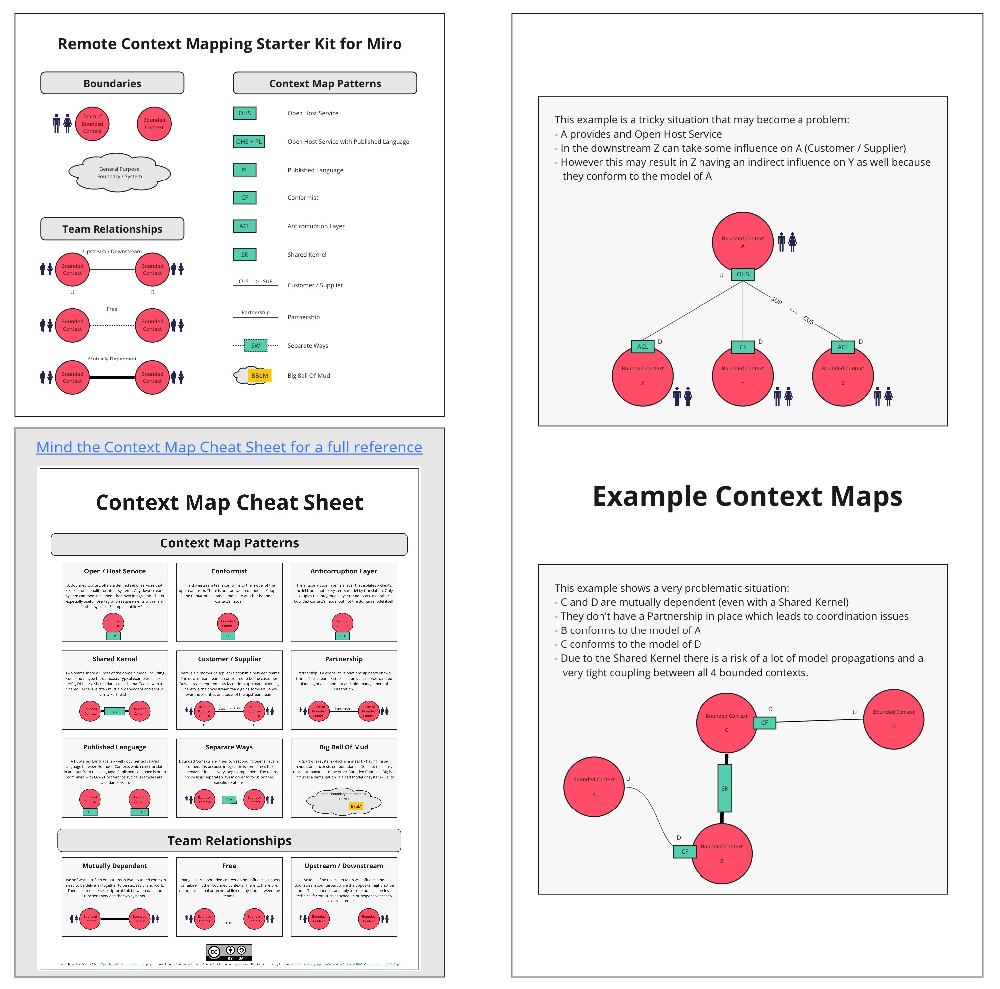

# Context Mapping

Context Maps describe the contact between bounded contexts and teams with a collection of patterns. There are nine context map patterns and three different team relationships. The context map patterns describe a variety of perspectives like service provisioning, model propagation or governance aspects. This diversity of perspectives enables you to get an holisitic overview of team and bounded context relationships.

Context Maps can be used to analyze existing systems or application landscapes but they are also suitable for upfront design considerations. However, we have realized that many folks struggle to get started with the context mapping patterns based on the definitions in the exsiting DDD books. This GitHub repository aims to give you some help with context maps with a cheat sheet and a starter kit for Miro.

## Context Map Cheat Sheet

Here is a cheat sheet containing brief descriptions of the context mapping patterns:

## Remote Context Mapping Starter Kit for Miro

If you perform context mapping with Miro, there is a board backup that gets you started with all the objects for the patterns, team relationships and boundaries. In addition to that the Miro board contains a few examples to get you started:

[Link to Miro Board Backup](resources/Remote-Context-Mapping-Starter-Kit.rtb)

You can also check out (and comment) [a read-only version of the starter kit on Miro](https://miro.com/app/board/o9J_kqtuB6A=/)

## Context Mapping with Context Mapper

If you want to maintain your context maps in your code repo, [Context Mapper](https://contextmapper.org/docs/home/) allows you to describe your context in a text file and generate a diagram from it. It also include plugins for [Eclipse](https://contextmapper.org/docs/eclipse/) and [Visual Studio Code](https://contextmapper.org/docs/vs-code/).

## Further Reading

- [Dynamic Reteaming](https://leanpub.com/dynamicreteaming) 
- [Pioneers, Settlers & Town Planners](http://wardleypedia.org/mediawiki/index.php/Pioneers_settlers_town_planners)
- [Team Topologies](https://teamtopologies.com/)
- [Visualising Sociotechnical Architecture with Context Maps](https://speakerdeck.com/mploed/visualizing-sociotechnical-architectures-with-context-maps)

## Contributors

Thanks to all [existing and future contributors](https://github.com/ddd-crew/context-mapping/graphs/contributors) and to the following individuals who have all contributed to the Context Map Cheat Sheet:

- [Kacper Gunia](https://twitter.com/cakper)
- [Nick Tune](https://github.com/ntcoding)

## Contributions and Feedback

The Context Map Cheat Sheet is freely available for you to use. In addition, your feedback and ideas are welcome to improve the technique or to create alternative versions.

If you have questions you can ping us or open an [Issue](https://github.com/ddd-crew/context-map-cheat-sheet/issues/new/choose).

Feel free to also send us a pull request with your examples or experience reports.

You can also comment directly on the [Miro board of the Context Map Cheat Sheet](https://miro.com/app/board/o9J_kqrI8ck=/)

[![CC BY 4.0][cc-by-shield]][cc-by]

This work is licensed under a [Creative Commons Attribution 4.0 International
License][cc-by].

[![CC BY 4.0][cc-by-image]][cc-by]

[cc-by]: http://creativecommons.org/licenses/by/4.0/
[cc-by-image]: https://i.creativecommons.org/l/by/4.0/88x31.png
[cc-by-shield]: https://img.shields.io/badge/License-CC%20BY%204.0-lightgrey.svg
